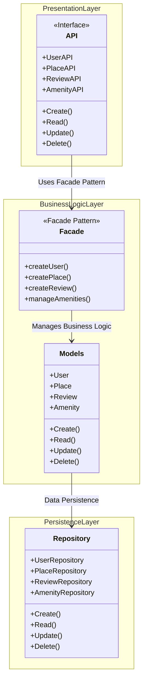
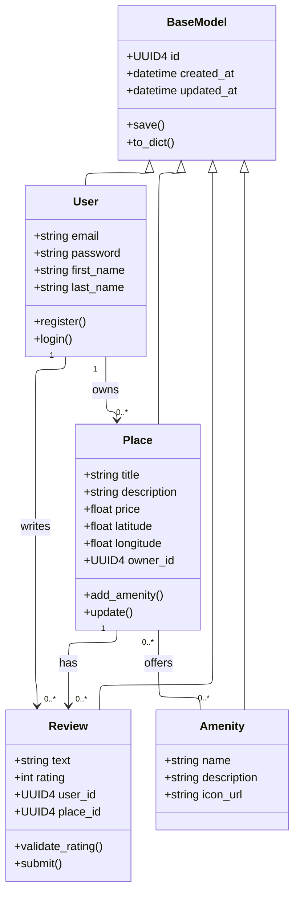
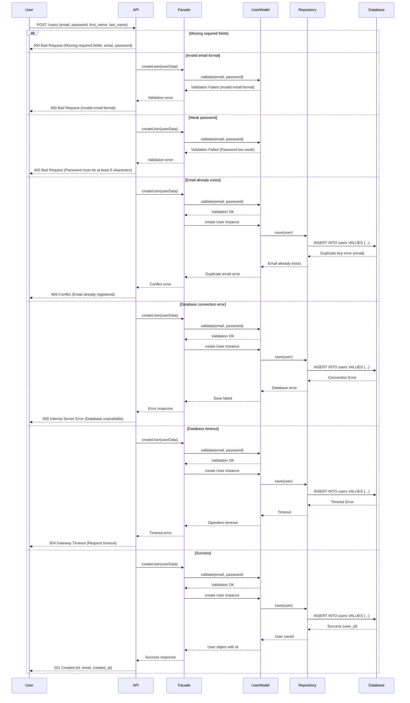
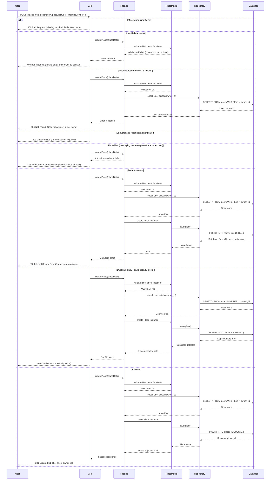
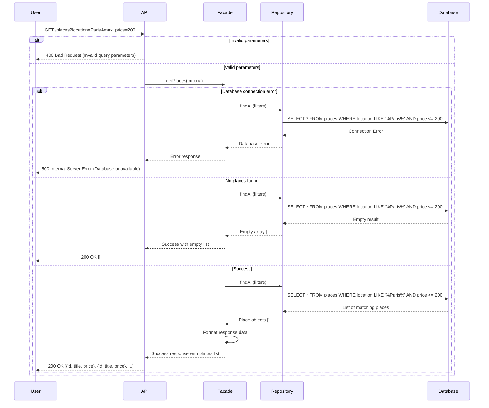

```mermaid
sequenceDiagram
    participant User
    participant API
    participant Facade
    participant ReviewModel
    participant Repository
    participant Database

    User->>API: POST /reviews {text, rating, user_id, place_id}
    
    alt Missing required fields
        API-->>User: 400 Bad Request (Missing required fields: text, rating, place_id)
    
    else Invalid rating value
        API->>Facade: createReview(reviewData)
        Facade->>ReviewModel: validate_rating(rating)
        ReviewModel-->>Facade: Rating invalid (must be 1-5)
        Facade-->>API: Validation error
        API-->>User: 400 Bad Request (Rating must be between 1 and 5)
    
    else Empty review text
        API->>Facade: createReview(reviewData)
        Facade->>ReviewModel: validate_rating(rating)
        ReviewModel-->>Facade: Rating valid (1-5)
        ReviewModel-->>Facade: Text validation failed (empty)
        Facade-->>API: Validation error
        API-->>User: 400 Bad Request (Review text cannot be empty)
    
    else Place not found
        API->>Facade: createReview(reviewData)
        Facade->>Repository: check place exists (place_id)
        Repository->>Database: SELECT * FROM places WHERE id = place_id
        Database-->>Repository: Place not found
        Repository-->>Facade: Place does not exist
        Facade-->>API: Error response
        API-->>User: 404 Not Found (Place with place_id not found)
    
    else User not found
        API->>Facade: createReview(reviewData)
        Facade->>Repository: check place exists (place_id)
        Repository->>Database: SELECT * FROM places WHERE id = place_id
        Database-->>Repository: Place found
        Repository-->>Facade: Place verified
        Facade->>Repository: check user exists (user_id)
        Repository->>Database: SELECT * FROM users WHERE id = user_id
        Database-->>Repository: User not found
        Repository-->>Facade: User does not exist
        Facade-->>API: Error response
        API-->>User: 404 Not Found (User with user_id not found)
    
    else Unauthorized (not authenticated)
        API-->>User: 401 Unauthorized (Authentication required)
    
    else Forbidden (reviewing own place)
        API->>Facade: createReview(reviewData)
        Facade->>Repository: check place exists (place_id)
        Repository->>Database: SELECT * FROM places WHERE id = place_id
        Database-->>Repository: Place found
        Repository-->>Facade: Place verified
        Facade->>Facade: Check if user is place owner
        Facade-->>API: Authorization check failed
        API-->>User: 403 Forbidden (Cannot review your own place)
    
    else Duplicate review (user already reviewed this place)
        API->>Facade: createReview(reviewData)
        Facade->>Repository: check place exists (place_id)
        Repository->>Database: SELECT * FROM places WHERE id = place_id
        Database-->>Repository: Place found
        Repository-->>Facade: Place verified
        Facade->>ReviewModel: validate_rating(rating)
        ReviewModel-->>Facade: Rating valid (1-5)
        Facade->>Repository: check existing review (user_id, place_id)
        Repository->>Database: SELECT * FROM reviews WHERE user_id = ? AND place_id = ?
        Database-->>Repository: Review already exists
        Repository-->>Facade: Duplicate review detected
        Facade-->>API: Conflict error
        API-->>User: 409 Conflict (You have already reviewed this place)
    
    else Database error
        API->>Facade: createReview(reviewData)
        Facade->>Repository: check place exists (place_id)
        Repository->>Database: SELECT * FROM places WHERE id = place_id
        Database-->>Repository: Place found
        Repository-->>Facade: Place verified
        Facade->>ReviewModel: validate_rating(rating)
        ReviewModel-->>Facade: Rating valid (1-5)
        Facade->>ReviewModel: create Review instance
        ReviewModel->>Repository: save(review)
        Repository->>Database: INSERT INTO reviews VALUES (...)
        Database-->>Repository: Database Error (Connection failed)
        Repository-->>ReviewModel: Save failed
        ReviewModel-->>Facade: Error
        Facade-->>API: Database error
        API-->>User: 500 Internal Server Error (Database unavailable)
    
    else Success
        API->>Facade: createReview(reviewData)
        Facade->>Repository: check place exists (place_id)
        Repository->>Database: SELECT * FROM places WHERE id = place_id
        Database-->>Repository: Place found
        Repository-->>Facade: Place verified
        Facade->>ReviewModel: validate_rating(rating)
        ReviewModel-->>Facade: Rating valid (1-5)
        Facade->>ReviewModel: create Review instance
        ReviewModel->>Repository: save(review)
        Repository->>Database: INSERT INTO reviews VALUES (...)
        Database-->>Repository: Success (review_id)
        Repository-->>ReviewModel: Review saved
        ReviewModel-->>Facade: Review object with id
        Facade-->>API: Success response
        API-->>User: 201 Created {id, text, rating, place_id}
    end
```

# HBnB Application - Technical Documentation

**Project**: HBnB (Holberton AirBnB Clone)  
**Version**: 1.0  
**Date**: February 2026  
**Authors**: Hugo Ramos

---

## Table of Contents

1. [Introduction](#introduction)
2. [High-Level Architecture](#high-level-architecture)
3. [Business Logic Layer - Detailed Design](#business-logic-layer)
4. [API Interaction Flow](#api-interaction-flow)
5. [Conclusion](#conclusion)

---

## Introduction

### Project Overview

HBnB is a web application that allows users to list, discover, and book accommodations. Similar to Airbnb, the platform connects property owners with travelers seeking short-term rentals. This application handles user management, property listings, reviews, and amenity information.

### Purpose of This Document

This technical documentation serves as a comprehensive blueprint for the HBnB application. It provides:

- **Architectural overview** of the system's structure
- **Detailed design specifications** for core business entities
- **Interaction flows** for key API operations
- **Implementation guidelines** for developers

This document is intended for:
- Development team members
- Technical leads and architects
- QA engineers
- Future maintainers of the codebase

### Document Scope

This documentation covers:
- **System Architecture**: Three-layer architecture with Facade Pattern
- **Business Logic**: Core entities (User, Place, Review, Amenity)
- **API Design**: Four critical API call flows
- **Design Decisions**: Rationale behind architectural choices

---

## High-Level Architecture

### Overview

The HBnB application follows a **three-layer architecture** pattern, which provides clear separation of concerns and promotes maintainability, testability, and scalability.

### Architecture Diagram



### Layer Descriptions

#### Presentation Layer (Services/API)

**Role**: The Presentation Layer serves as the interface between users and the application. It handles all incoming HTTP requests and outgoing responses.

**Components**:
- **API REST**: Exposes RESTful endpoints for client applications
- **Routes/Endpoints**: Defines URL patterns for different operations
  - `/users` - User management
  - `/places` - Place listings management
  - `/reviews` - Review management
  - `/amenities` - Amenity management
- **HTTP Requests**: Processes GET, POST, PUT, DELETE requests from clients
- **CRUD Operations**: Each API endpoint exposes Create, Read, Update, and Delete methods

**Responsibilities**:
- Receive and validate user requests
- Format and return JSON responses
- Handle authentication and authorization
- Route requests to the appropriate business logic through the Facade

---

#### Business Logic Layer (Models)

**Role**: The Business Logic Layer contains the core functionality and rules of the application. It processes data according to business requirements and coordinates operations between the Presentation and Persistence layers.

**Components**:

**Facade Pattern**  
The Facade provides a simplified interface for the Presentation Layer to interact with the Business Logic. It acts as a single entry point, hiding the complexity of the underlying system.

**Key Methods:**
- `createUser()` - Handles user registration with validation
- `createPlace()` - Manages place creation with business rules
- `createReview()` - Processes review submissions with validation
- `manageAmenities()` - Handles amenity operations

**Models**  
The core entities that represent the business domain:

- **User**: Represents registered users who can list places or write reviews
  - Attributes: id, email, password, first_name, last_name
  - Methods: register(), login()

- **Place**: Represents properties available for rent
  - Attributes: id, title, description, price, location, owner
  - Methods: add_amenity(), update_details()

- **Review**: Represents user feedback on places
  - Attributes: id, text, rating, user_id, place_id
  - Methods: validate_rating(), submit()

- **Amenity**: Represents facilities and services available at places
  - Attributes: id, name, description
  - Methods: associate_to_place()

**Responsibilities**:
- Apply business rules and validation
- Coordinate complex operations across multiple entities
- Ensure data integrity before persistence
- Transform data between layers

---

#### Persistence Layer (Database)

**Role**: The Persistence Layer is responsible for data storage and retrieval. It manages all interactions with the database, ensuring data is saved and retrieved correctly.

**Components**:
- **Repositories**: Data access objects for each entity
  - `UserRepository` - Handles User data operations
  - `PlaceRepository` - Handles Place data operations
  - `ReviewRepository` - Handles Review data operations
  - `AmenityRepository` - Handles Amenity data operations

- **Database Access**: Manages database connections and transactions

- **SQL Queries**: Executes CRUD operations (Create, Read, Update, Delete)
- **CRUD Methods**: Each repository implements `Create()`, `Read()`, `Update()`, and `Delete()` operations for its entity

**Responsibilities**:
- Store entities in the database
- Retrieve data based on queries
- Update existing records
- Delete records when required
- Manage database transactions and ensure data consistency

---

### Facade Pattern Implementation

**Purpose**  
The Facade Pattern simplifies communication between the Presentation Layer and the Business Logic Layer by providing a unified interface.

**Benefits**:
1. **Reduced Complexity**: The Presentation Layer doesn't need to know the details of the Business Logic implementation
2. **Loose Coupling**: Changes in the Business Logic don't directly impact the Presentation Layer
3. **Centralized Control**: All business operations go through a single point, making it easier to add logging, security, or caching
4. **Improved Maintainability**: Easier to modify or extend functionality without affecting multiple parts of the system

**How It Works**:
```
User Request (API) 
    → Facade 
    → Business Logic (Models) 
    → Persistence (Database)
    ← Response flows back through the same path
```

Instead of the API directly calling multiple model classes and repositories, it simply calls the Facade, which orchestrates all necessary operations internally.

---

### Communication Flow Example

**Scenario**: A user creates a new place listing

1. **Presentation Layer**: API receives POST request to `/places`
2. **Facade**: `createPlace()` method is called with place data
3. **Business Logic**: 
   - Validates the place data
   - Checks if the user is authorized
   - Creates a Place object
4. **Persistence Layer**: 
   - `PlaceRepository.save()` stores the place in the database
5. **Response**: Success confirmation flows back through Facade → API → User

---

### Design Decisions

**Why Three Layers?**
- **Separation of Concerns**: Each layer has a specific responsibility
- **Testability**: Each layer can be tested independently
- **Scalability**: Layers can be scaled separately based on needs
- **Flexibility**: Easy to swap implementations (e.g., change database without affecting business logic)

**Why Facade Pattern?**
- Simplifies the API layer implementation
- Provides a stable interface even when internal implementation changes
- Makes the codebase easier to understand and maintain

---

## Business Logic Layer - Detailed Design

### Overview

This section provides a detailed view of the Business Logic Layer, focusing on the core entities, their attributes, methods, and relationships.

### Class Diagram



### Entity Descriptions

#### BaseModel

**Purpose**: Serves as the parent class for all business entities, providing common attributes and methods.

**Attributes**:
- `id (UUID4)`: Unique identifier for each instance
- `created_at (datetime)`: Timestamp of entity creation
- `updated_at (datetime)`: Timestamp of last modification

**Methods**:
- `save()`: Persists the entity to the database
- `to_dict()`: Converts the entity to a dictionary representation

**Design Rationale**: Centralizes common functionality to avoid code duplication (DRY principle) and ensures all entities have consistent identification and tracking.

---

#### User

**Purpose**: Represents registered users who can create places and write reviews.

**Attributes**:
- `email (string)`: User's email address (unique)
- `password (string)`: Encrypted password for authentication
- `first_name (string)`: User's first name
- `last_name (string)`: User's last name

**Methods**:
- `register()`: Creates a new user account with validation
- `login()`: Authenticates user credentials

**Inherited from BaseModel**:
- `id`, `created_at`, `updated_at`
- `save()`, `to_dict()`

**Business Rules**:
- Email must be unique across the system
- Password must meet security requirements (hashed before storage)
- Users can own multiple places
- Users can write multiple reviews

---

#### Place

**Purpose**: Represents properties available for rental.

**Attributes**:
- `title (string)`: Name of the property
- `description (string)`: Detailed description
- `price (float)`: Rental price per night
- `latitude (float)`: Geographic coordinate
- `longitude (float)`: Geographic coordinate
- `owner_id (UUID4)`: Foreign key to User who owns this place

**Methods**:
- `add_amenity()`: Associates an amenity with this place
- `update()`: Updates place information

**Inherited from BaseModel**:
- `id`, `created_at`, `updated_at`
- `save()`, `to_dict()`

**Business Rules**:
- Each place must have exactly one owner (User)
- Price must be a positive number
- Latitude/longitude must be valid coordinates
- A place can have multiple amenities
- A place can receive multiple reviews

---

#### Review

**Purpose**: Represents user feedback on places they've stayed at.

**Attributes**:
- `text (string)`: Review content
- `rating (int)`: Numeric rating (1-5 stars)
- `user_id (UUID4)`: Foreign key to User who wrote the review
- `place_id (UUID4)`: Foreign key to Place being reviewed

**Methods**:
- `validate_rating()`: Ensures rating is within acceptable range (1-5)
- `submit()`: Saves the review after validation

**Inherited from BaseModel**:
- `id`, `created_at`, `updated_at`
- `save()`, `to_dict()`

**Business Rules**:
- Rating must be between 1 and 5 (inclusive)
- Review text cannot be empty
- Each review belongs to exactly one user and one place
- Optional: A user can only review a place once

---

#### Amenity

**Purpose**: Represents facilities and services available at places.

**Attributes**:
- `name (string)`: Amenity name (e.g., "WiFi", "Pool", "Parking")
- `description (string)`: Detailed description
- `icon_url (string)`: URL to the amenity's icon image

**Inherited from BaseModel**:
- `id`, `created_at`, `updated_at`
- `save()`, `to_dict()`

**Business Rules**:
- Amenity names should be unique
- Multiple places can offer the same amenity
- A place can have multiple amenities (many-to-many relationship)

---

### Relationship Details

#### User — Place (1 : 0..*)

**Meaning**: A User can own zero, one, or many Place instances.

**Implementation**: 
- `Place.owner_id` references the `User.id` (foreign key)

**Rationale**: A user account can create or own multiple listings (e.g., places), but each place has a single owner. This ensures clear ownership and accountability.

**SQL Constraint**:
```sql
FOREIGN KEY (owner_id) REFERENCES users(id) ON DELETE CASCADE
```

---

#### User — Review (1 : 0..*)

**Meaning**: A User can write zero, one, or many Review entries.

**Implementation**:
- `Review.user_id` references the `User.id`

**Rationale**: Every review is authored by a user. A user may leave multiple reviews for different places, enabling comprehensive feedback across the platform.

**SQL Constraint**:
```sql
FOREIGN KEY (user_id) REFERENCES users(id) ON DELETE CASCADE
```

---

#### Place — Review (1 : 0..*)

**Meaning**: A Place can receive zero, one, or many Review entries.

**Implementation**:
- `Review.place_id` references the `Place.id`

**Rationale**: A place may have many reviews from different users, providing potential guests with multiple perspectives. Each review targets a single place.

**SQL Constraint**:
```sql
FOREIGN KEY (place_id) REFERENCES places(id) ON DELETE CASCADE
```

---

#### Place — Amenity (0..* : 0..*)

**Meaning**: Many-to-many relationship - a Place can offer multiple Amenity items, and an Amenity can be offered by multiple Place instances.

**Implementation**:
- Requires a join table: `place_amenities`
- Contains `place_id` and `amenity_id` (both foreign keys)

**Rationale**: This flexible relationship allows:
- Places to advertise multiple amenities (WiFi, Pool, Parking)
- The same amenity to be reused across many places
- Easy querying ("show me all places with WiFi")

**SQL Schema**:
```sql
CREATE TABLE place_amenities (
    place_id UUID REFERENCES places(id) ON DELETE CASCADE,
    amenity_id UUID REFERENCES amenities(id) ON DELETE CASCADE,
    PRIMARY KEY (place_id, amenity_id)
);
```

---

### Technical Implementation Notes

**UUID4 as Primary Keys**:
- All entities use UUID4 for unique identification
- Provides globally unique IDs without coordination
- Better for distributed systems and security

**Timestamps**:
- `created_at` and `updated_at` inherited from BaseModel
- Automatically managed by the persistence layer
- Essential for auditing and tracking changes

**Foreign Key Constraints**:
- Maintain referential integrity at database level
- `ON DELETE CASCADE` ensures cleanup when parent entities are deleted
- Prevents orphaned records

**Inheritance Pattern**:
- All entities inherit from BaseModel
- Promotes code reuse (DRY principle)
- Ensures consistent behavior across entities

---

## API Interaction Flow

### Overview

This section illustrates the complete request-response cycle for four critical API operations. Each sequence diagram shows how the different layers of the architecture interact to fulfill user requests.

---

### 1. User Registration

**Purpose**: Allows a new user to create an account on the platform.

**API Endpoint**: POST /users

**Request Data**:
```json
{
  "email": "user@example.com",
  "password": "securepassword123",
  "first_name": "John",
  "last_name": "Doe"
}
```

**Sequence Diagram**:



**Flow Steps**:

1. User submits registration data via POST request
2. API calls `createUser()` with the user data
3. Facade validates the data (email format, password strength)
4. Returns validation confirmation
5. Creates a new User instance with validated data
6. Calls `save()` to persist the user
7. Executes INSERT query to add user to database
8. Confirms successful insertion with user_id
9. Confirms user has been saved
10. Returns the complete User object with generated id
11. Returns success response
12. Sends HTTP 201 Created with user details

**Key Validations**:
- Email format validation
- Password strength requirements
- Unique email constraint (checked at database level)

**Response**: 201 Created
```json
{
  "id": "f47ac10b-58cc-4372-a567-0e02b2c3d479",
  "email": "user@example.com",
  "created_at": "2024-02-08T10:30:00Z"
}
```

---

### 2. Place Creation

**Purpose**: Allows an authenticated user to create a new place listing.

**API Endpoint**: POST /places

**Request Data**:
```json
{
  "title": "Cozy Paris Apartment",
  "description": "Beautiful 2-bedroom apartment in central Paris",
  "price": 150.00,
  "latitude": 48.8566,
  "longitude": 2.3522,
  "owner_id": "f47ac10b-58cc-4372-a567-0e02b2c3d479"
}
```

**Sequence Diagram**:



**Key Validations**:
- Title not empty
- Price is positive number
- Valid geographic coordinates
- Owner (user_id) exists in database

**Response**: 201 Created
```json
{
  "id": "a3bb189e-8bf9-3888-9912-ace4e6543002",
  "title": "Cozy Paris Apartment",
  "price": 150.00,
  "owner_id": "f47ac10b-58cc-4372-a567-0e02b2c3d479"
}
```

---

### 3. Review Submission

**Purpose**: Allows a user to submit a review for a place they visited.

**API Endpoint**: POST /reviews

**Request Data**:
```json
{
  "text": "Amazing stay! Clean and comfortable.",
  "rating": 5,
  "user_id": "f47ac10b-58cc-4372-a567-0e02b2c3d479",
  "place_id": "a3bb189e-8bf9-3888-9912-ace4e6543002"
}
```

**Sequence Diagram**:



**Key Validations**:
- Rating must be between 1 and 5
- Text not empty
- Place (place_id) must exist
- User (user_id) must exist
- Optional: User cannot review the same place twice

**Response**: 201 Created
```json
{
  "id": "550e8400-e29b-41d4-a716-446655440000",
  "text": "Amazing stay! Clean and comfortable.",
  "rating": 5,
  "place_id": "a3bb189e-8bf9-3888-9912-ace4e6543002"
}
```

---

### 4. Fetching a List of Places

**Purpose**: Retrieves a filtered list of available places based on search criteria.

**API Endpoint**: GET /places

**Query Parameters**: `?location=Paris&max_price=200`

**Sequence Diagram**:



**Query Building**:
```sql
SELECT * FROM places 
WHERE location LIKE '%Paris%' 
AND price <= 200
```

**Key Features**:
- Supports multiple filter criteria
- Returns empty array if no matches found
- Can include pagination (limit, offset)
- Results can be sorted by price, rating, etc.

**Response**: 200 OK
```json
[
  {
    "id": "a3bb189e-8bf9-3888-9912-ace4e6543002",
    "title": "Cozy Paris Apartment",
    "price": 150.00
  },
  {
    "id": "b4cc290f-9cf0-4999-a023-bdf5f7654113",
    "title": "Paris Studio",
    "price": 120.00
  }
]
```

---

### Common Patterns Across All Diagrams

**Layer Interaction Flow**:
```
User → API → Facade → Model/Repository → Database → (reverse flow)
```

**Error Handling** (not shown in diagrams):
- **API Layer**: 400 Bad Request (invalid input)
- **Facade/Model**: Validation errors
- **Repository**: 404 Not Found (resource doesn't exist)
- **Database**: 500 Internal Server Error (connection issues)

**Facade Pattern Benefits**:
- Single entry point for API layer
- Consistent validation and error handling
- Abstraction of complex operations
- Easier testing and maintenance

**Database Operations**:
- **Create operations**: Use INSERT queries
- **Read operations**: Use SELECT queries
- **Foreign key validation**: Ensures referential integrity

---

### Technical Implementation Notes

**Asynchronous vs Synchronous**:
These diagrams show synchronous operations (blocking calls). In production, some operations might be asynchronous for better performance.

**Transaction Management**:
Create operations (User, Place, Review) should be wrapped in database transactions to ensure data consistency.

**Caching**:
For the "Fetching Places" operation, results could be cached to improve performance for repeated queries.

**Authentication**:
In a real implementation, all endpoints except User Registration would require authentication tokens (not shown in diagrams for clarity).

---

## Conclusion

### Summary

This technical documentation has presented a comprehensive overview of the HBnB application architecture, covering:

1. **Three-Layer Architecture**: Clear separation between Presentation, Business Logic, and Persistence layers
2. **Facade Pattern**: Simplified communication between layers through a unified interface
3. **Core Business Entities**: Detailed design of User, Place, Review, and Amenity classes
4. **API Workflows**: Step-by-step interaction flows for critical operations

### Architectural Benefits

The chosen architecture provides:

- **Maintainability**: Clear separation of concerns makes the codebase easier to understand and modify
- **Testability**: Each layer can be tested independently with mock objects
- **Scalability**: Layers can be scaled separately based on system demands
- **Flexibility**: Easy to swap implementations (e.g., different database systems) without affecting other layers
- **Security**: Centralized validation and authentication through the Facade layer

### Design Principles Applied

- **Separation of Concerns**: Each component has a single, well-defined responsibility
- **DRY (Don't Repeat Yourself)**: Common functionality centralized in BaseModel
- **Single Responsibility Principle**: Each class has one reason to change
- **Dependency Inversion**: High-level modules don't depend on low-level modules
- **Open/Closed Principle**: Open for extension, closed for modification

### Next Steps

This documentation serves as the foundation for:

1. **Implementation Phase**: Developers can use this as a reference while coding
2. **Testing Phase**: QA engineers can design test cases based on these specifications
3. **Code Reviews**: Ensure implementations align with documented architecture
4. **Future Enhancements**: New features should follow these established patterns
5. **Onboarding**: New team members can quickly understand the system design

### Maintenance and Updates

This document should be:

- **Updated** whenever architectural decisions change
- **Reviewed** during sprint planning and retrospectives
- **Referenced** during code reviews and design discussions
- **Versioned** alongside the codebase in the repository

---

**Document Version**: 1.0  
**Last Updated**: February 2026  
**Status**: Pending Approval